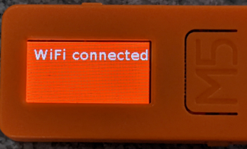
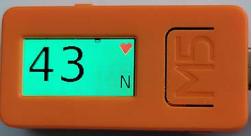

# purple_air
Code for displaying Air Quality from a Purple Air device

Read and display Air Quality from a local [Purple Air](
https://www.purpleair.com/) device on a [M5Stack M5StickC](
https://m5stack.com/products/stick-c) "finger" computer.

See my [blog post](
https://seeingclaarly.blogspot.com/2020/05/seeing-airquality.html) for more
information on the Purple Air unit, my design decisions, and my unique
writing style. :)

## Setup

Set up the M5StickC for UIFLow (currently, 1.4.5.1 is the latest) using the
[M5Burner utility](https://m5stack.com/pages/download). Once this is done, the
software needs to be loaded onto the M5StickC device. There's a few different
ways to do this. I've provided a fairly simple way:

1. Open UIFlow
1. Switch to the python tab
1. Copy `copy_to_stick.py` from the repo and paste it into the window.
1. Modify this line with the IP address of your purple air device:
   ```
   file_data = '{"ip_addr": "192.168.x.y"}\n'
   ```
1. Click the triangle "play" button. This will copy `AQI.py` to the `flash/apps`
directory, and the `m5stickc.py` library and `aqi.json` config file to the
`flash` directory. You will not need `copy_to_stick.py` any more.

## Run

Restart the M5StickC by holding down the button on the left (the power button)
while holding down the front button (the "A" button): It will show "Program".


Use the button on the right (the "B" button) to navigate to APPS.

 

Press the A button to enter APPS. Use the B button to
scroll down to AQI.


Press A to start the app. Now set the M5StickC on its
side--doesn't matter which one--and after a bit it should show
`WiFi connected`,



Then start displaying the air quality.

.

## Features

- Uses accelerometer to display text correctly with device on either side.
- Uses the WiFi credentials that were setup in M5Burner.
- All of the hardware-specific code is abstracted to m5stick.py, so it is
  possible to port to another platform. (Well, at least in theory: The
  code is designed around the M5StickC's capabilities).
- Heartbeat shows that the unit is working, even if the AQI isn't changing.
- Brightness can be adjusted, and is remembered if the unit is restarted: Hit
  the A button, use the B button to adjust, and then A to save and return.
- Demo mode shows what various AQI levels would look like: Hit the B button,
  use the B button again to cycle through the levels, then use A to return.

## TODO

The EPA just recently [did a study](
https://cfpub.epa.gov/si/si_public_record_report.cfm?Lab=CEMM&dirEntryId=348236)
on the accuracy of the Purple Air sensors. The net result is a bit uncertain:
Adjusting for temperature and relative humidity--the unit reports both, so it
would be possible to include the calculation--seemed to make the readings
more accurate at lower levels, but may under-report at higher levels.
I might add in an option to either choose, or to automatically switch at some
level, but haven't decided yet.


