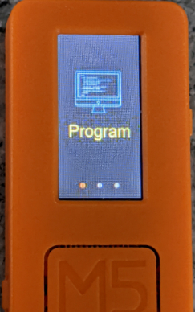
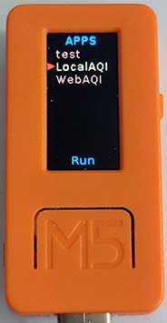

# purple_air
Code for displaying Air Quality from a Purple Air device or Web endpoint.

Read and display Air Quality from a local [Purple Air](
https://www.purpleair.com/) device--or from a Purple Air device that is
on the web--on a [M5Stack M5StickC](
https://m5stack.com/products/stick-c) "finger" computer.

The local version Uses the local JSON endpoint's built-in 120 second average,
which is updated every 10 seconds.

The web version uses the default values for the purpleair.com JSON endpoint,
which appears to be a 10 minute average. This value is read every 30 seconds.

See my [blog post](
https://seeingclaarly.blogspot.com/2020/05/seeing-airquality.html) for more
information on the Purple Air unit, my design decisions, and my unique
writing style. :)

## Setup

Set up the M5StickC for UIFLow using the [M5Burner utility](
https://m5stack.com/pages/download).
Once this is done, the software needs to be loaded onto the M5StickC device.
There's a few different ways to do this.  Alternatives include [rshell](
https://github.com/dhylands/rshell), or you
can setup [Visual Studio Code](https://code.visualstudio.com/) and install the
m5stack extension.

If you have a 1.5.x or greater version of UiFlow,
I've set up a _relatively_ simple [set of steps](copy_to_stick.md) to
use the UiFlow GUI to make the copy. 

No matter how you get the code onto the M5StickC, you will need to
provide either the IP address of your local unit or the "device number"
of the station that you want to monitor. To get the web "device number",
click on the station you want to track, and the URL will change to something
like this:

```
https://www.purpleair.com/map?opt=1/mAQI/a10/cC0&select=38889#15/37.25548/-121.8908
```

This shows you the device number of `38889` and the station's Latitude and
Longitude.

## Run

Restart the M5StickC by holding down the button on the left (the power button)
while holding down the front button (the "A" button): It will show "Program".



Use the button on the right (the "B" button) to navigate to APPS.

Press the A button to enter APPS. Use the B button to
scroll down to either LocalAQI or WebAQI depending on which one you have
chosen.



Press A to start the app. Now set the M5StickC on its
side--doesn't matter which one--and after a bit it should show
`WiFi connected`,


Then start displaying the air quality.

.

## Brightness and Correction Settings

- Brightness can be adjusted, and is remembered if the unit is restarted: Hit
  the B button, use the B button to adjust, and then A to save and return.
- There are several different correction factors: Hit the A button,
  use the B button again to cycle through the corrections, then use A to
  return.The numbers and colors change as you cycle through so that you
  can see what they would be.

## Hardware Abstractions
- All of the hardware-specific code is abstracted to m5stick.py, so it is
  possible to port to another platform. (Well, at least in theory: The
  code is designed around the M5StickC's capabilities).
- The sensor interface has been abstracted so that different devices, or even
  different ways to access the same device, can be easily implemented.

## Other Features

- Uses accelerometer to display text correctly with device on either side.
  - Note that this pauses during sub-modes (brightness & corrections).
- Uses the WiFi credentials that were setup in M5Burner.
- Heartbeat shows that the unit is working, even if the AQI isn't changing.
- There is also a "marching ants" chaser to show that it is working. See below.
- If one is in a sub-mode (brightness & corrections) and forgets to exit,
  it will exit back to the main menu eventually.


### "Marching ants"

I'm currently on the fence about the "marching ants" animation. This
animation is a hollow rectangle that runs around the edge of the display
clockwise. Since I couldn't decide if I liked it or not, I put a constant
in the `aqi.py` file. If `CHASER` is `True`, then the animation will run;
otherwise it won't. It is `True` in this iteration.

## Correction factors

The technology used by the Purple Air monitors can read somewhat high,
particulately :) for fire smoke. There have been several studies that
suggest correction factors.

### None

There are 2 versions of "none", although one of them only works with the
local web interface. 

The local web interface provides AQI and color values directly. This is
represented by "R" on the display.

AQI and color can be calculated from PM2.5, and both the local interface and
the internet provide that value. This is represented by "N" on the display.

### EPA

The EPA just recently [did a study](
https://cfpub.epa.gov/si/si_public_record_report.cfm?Lab=CEMM&dirEntryId=348236)
on the accuracy of the Purple Air sensors. This implements their suggested
correction factor, and shows as an "E" on the display. Note that, at very
high levels, this correction may under-report.

### LRAPA

The [Lane Regional Air Protection Agency](https://www.lrapa.org/301/Particulate-Matter-Air-Sensors) in Springfield, Oregon has created [a correction factor](
https://www.lrapa.org/307/Air-Quality-Sensors) for wood smoke. This is represented by "L" on the display.

### AQ&U

The University of Utah [did a study](https://aqandu.org/airu_sensor). This
adjustment is probably good for large urban areas like Salt Lake City. This
is represented by "A" on the display.

### Lawrence Berkeley Lab & UC Berkeley

The results from this study are "it depends on the event", but their
_current_ correction factor is pretty close to EPA and LRPA,
so I didn't include it.

## Development

_If you want to hack on this, read on_.

### urequest, I request, punting redirects

The Purple Air site appears to sometimes throw redirects, which the M5stack
urequest module punts on. I am copying a
[urequest that supports redirection](
https://github.com/pfalcon/pycopy-lib/tree/master/urequests), with a one-line
modification to print the redirect on the console. (Open Source for the win!)
Eventually I will either modify the setup script to just copy it from the original source, or just catch the redirect punt, but for now I want the extra debug.
Note that the setup scripts do **not** copy this file, as it is
for development only.

### Simulating the hardware

It is painful to develop on the M5StickC, so I created a hardware simulation
using [pygame](https://www.pygame.org/). Pygame is easy to use, and it
has primatives that are very similar to the micropython `lcd` module, making
the simulation fairly straight-forward.

This allows you to put in print statements **and see them**, as well as
seeing any logic errors without having to copy to the device every time.

In the pygame window, 'a' and 'b' stand in for the hardware buttons;
'q' quits the simulation.

The programs automatically detect if they are on the M5StickC and use the
simulation if they are not.

### Simulator requirements

1. python 3.
1. `pip install pygame` to get pygame for python.
1. [DejaVu Sans Mono](https://dejavu-fonts.github.io/) font.
1. You will need to modify PYTHONPATH to run the simulation (see below).
1. It's probably easiest to run out of the `flash` directory:
   ```
   purple_air\flash>python3 apps/PurpleLocal.py
   ```

#### PYTHONPATH

In a command window:

```
echo %PYTHONPATH%.
```

If this gives you a path, use:

```
Set PYTHONPATH=C:\Path\to\purple_air\flash;%PYTHONPATH%
```

If it doesn't, **do not add ;%PYTHONPATH%**: 
windows will keep it as `%PYTHONPATH%` and everything will break!

I am indebted to this [stackoverflow post](
https://stackoverflow.com/questions/3701646/how-to-add-to-the-pythonpath-in-windows-so-it-finds-my-modules-packages),
which I don't have enough "credit" to upvote.
 
Linux and Mac are more reasonable here: You always do the same thing:

 ```
 export PYTHONPATH="/path/to/purple_air/flash;$PYTHONPATH"
 ```

Here is a handy way to see if the path looks right:

```
python -c "import sys; print('\n'.join(sys.path))"
```
